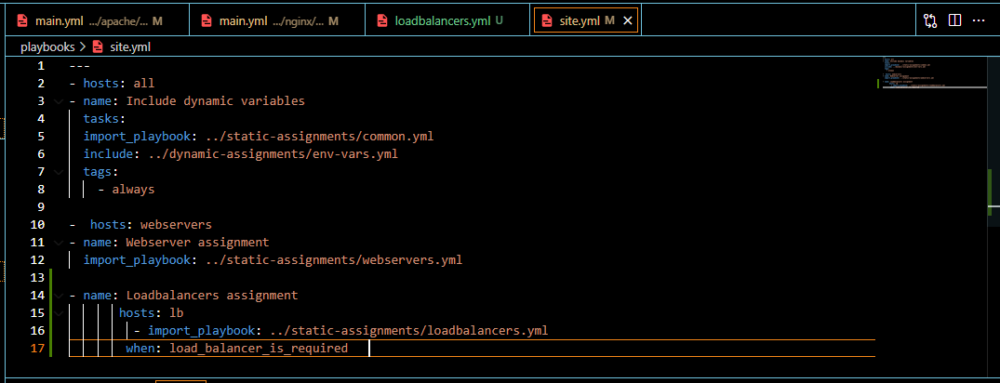

____
## **Ansible Dynamic Assignments (Include) and Community Roles**
____
In this project we will introduce [dynamic assignments](https://docs.ansible.com/ansible/latest/user_guide/playbooks_reuse.html#includes-dynamic-re-use) by using `include` module.  

In [Project 12](https://github.com/OlusegunMichael/Project_12_Ansible-Refactoring-Assignments-Imports/blob/main/Project_12_Documentation.md), we used **static** assignments using `import` Ansible module. The module that enables dynamic assignments is include.  

`import = Static`  
`include = Dynamic`  

When the `import` module is used, all statements are pre-processed at the time playbooks are parsed Meaning, when you execute `site.yml` playbook, Ansible will process all the playbooks referenced during the time it is parsing the statements. This also means that, during actual execution, if any statement changes, such statements will not be considered. Hence, it is static.  

On the other hand, when `include` module is used, all statements are processed only during execution of the playbook. Meaning, after the statements are parsed, any changes to the statements encountered during execution will be used.  

____
### **Step 1 - Introducing Dynamic Assignment Into the structure**
___

* In repo [ansible-config-mgt](https://github.com/OlusegunMichael/ansible-config-mgt.git) I create a new **branch** ``dynamic-assignments``  
* In this new **branch** I create a folder ``dynamic-assignments`` using *`mkdir dynamic-assignments`* and inside it a file ``env-vars.yml`` with *`touch env-vars.yml`*

Since I will be using the same Ansible to configure multiple environments, and each of these environments will have certain unique attributes, such as servername, ip-address etc., we will need a way to set values to variables per specific environment.

For this reason, we will now create a folder to keep each environment’s variables file. Therefore, create a new folder ``env-vars`` using *`mkdir env-vars`*, then for each environment, I created new YAML files using *`touch dev.yml prod.yml stage.yml uat.yml`* which we will use to set variables.

*  env-vars.yml file is update with the below

* Update site.yml file to make use of the dynamic assignment

____
### **Step 2 -Community Roles**
____
* Inside roles directory I created a new MySQL role with ' ``ansible-galaxy install geerlingguy.mysql``  and renamed the folder to mysql with the following commands;
* *`ansible-galaxy install geerlingguy.mysql`*- install mysql
* *`mv geerlingguy.nginx/ mysql`*- Renames folder to msql

* Inside roles directory I created a new NGINX & APACHE role with ' ``ansible-galaxy install geerlingguy.``  and renamed the folder to mysql with the following commands;
* *`ansible-galaxy install geerlingguy.nginx`* - install nginx
* *`mv geerlingguy.nginx/ nginx`* - Renames folder to nginx
* *`ansible-galaxy install geerlingguy.apache`*- install apache
* *`mv geerlingguy.nginx/ apache`*- Renames folder to apache

* Read ``README.md`` file, and edit roles configuration to use correct credentials for MySQL required for the tooling website.

* In the ``default`` folder of the MySql parent directory, edit the main.yml file.

* I create a Pull Request and merge it to main branch on GitHub

___
### **Step 3 -Load Balancer roles
___
To to be able to select which Load Balancer to utilise, Nginx or Apache, two roles are required. Because both Nginx and Apache load balancers cant be utilized together, a condition must be added to activate either one - so variables is used .

 * I Declared a variable in defaults/main.yml file inside the Nginx and Apache roles. Named each variables ' enable_nginx_lb ' and ' enable_apache_lb '.

* Set both values to false: ' enable_nginx_lb: false' and ' enable_apache_lb: false ' .

* Declared another variable in both roles: load_balancer_is_required and set its value to false as well

* I Created a file in static-assignments folder named loadbalancer.yml which was updated alog with site.yml file.

### Project End